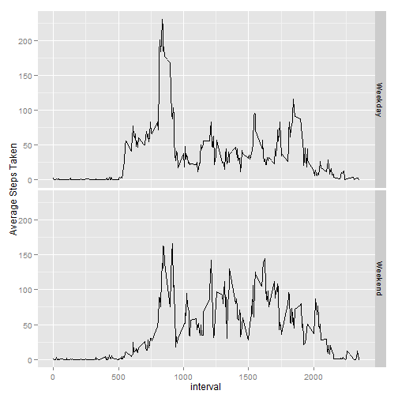

The purpose of this study is to analyze activity throughout the day of one individual, based upon a count of the number of steps taken throughout each day at 5-minute intervales

First make sure the right packages are available and read the activity file.  This has entries for number of steps taken at 5-minute intervals for 61 days.


```r
require (ggplot2)
require (data.table)
activity<-read.csv("activity.csv")
```

The first set of questions deals with number of sets per day, so here I create a data frame which aggregates the total steps take each day.  With this reduced data set it is possible to plot a histogram of the steps per day, plus the mean and median of steps per day.  In this section of the exercise I am ingoring NA values.


```r
totalSteps <- data.frame( aggregate (steps ~ date, data=activity,sum, na.rm=T))
hist(totalSteps$steps,breaks=seq(0,25000,by=1000),col="red",
        main ="Distribution of Steps Taken Per Day", xlab="Steps Per Day, NAs ignored")
```

 

```r
meanSteps <- mean(totalSteps$steps)
medianSteps <- median(totalSteps$steps)
```

To clarify, the mean number of steps taken per day is 1.0766 &times; 10<sup>4</sup> and the median number of steps taken per day is 10765.

Next the study considers how number of steps differs by time interval.

Note that the `echo = FALSE` parameter was added to the code chunk to prevent printing of the R code that generated the plot.  This requires aggregating the activity file by interval across all dates and then making a line plot.  Finally, which time interval has the greatest average number of steps?


```r
intervalSteps <- data.frame (aggregate (steps ~ interval, data=activity, mean, na.rm=T))
qplot(interval,steps,data=intervalSteps,geom="line")
```

 

```r
maxIntv<-intervalSteps[intervalSteps$steps==max(intervalSteps$steps),1]
maxSteps<-intervalSteps[intervalSteps$steps==max(intervalSteps$steps),2]
```

So the interval beginning at 835 averages 206.1698, which is the highest average for any 5-minute interval.

Now to fill in the missing values (NAs), using the simple strategy of substituting the average number of steps for that interval, each time an intervalue reading is NA.  

First, it is easy to calculate how many rows have missing data:


```r
sum(!complete.cases(activity))
```

```
## [1] 2304
```

For this we will create a new data frame, "imputedActivity", which is a copy of the activity data frame, but with all the NAs replaced as per this simple strategy.  The code simply loops through all rows and acts upon NA values by pulling the mean for that interval from the previously built mean of steps by time interval


```r
    imputedActivity <- activity

    for (i in 1:nrow(imputedActivity))   {
        if (!is.na(imputedActivity[i,1]))  next
        intv <- imputedActivity [i,3]
        imputedActivity[i,1] <- intervalSteps[intervalSteps$interval==intv,2]
    }
```

Now using the data with all of the NAs replaced by imputed values, we can again plot a historgram and calculate the mean and median of the steps by day.  Also we are going to show that some days had no readings before and have now been added to the calculations.


```r
totalStepsImp <- data.frame( aggregate (steps ~ date, data=imputedActivity,sum, na.rm=T))
hist(totalStepsImp$steps,breaks=seq(0,25000,by=1000),col="red",
     main ="Distribution, Steps Taken Per Day, NAs Imputed", xlab="Steps Per Day")
```

 

```r
impMean <- mean(totalStepsImp$steps)
impMedian <- median(totalStepsImp$steps)
diffDays <- nrow(totalStepsImp) - nrow(totalSteps)
```

So with imputed values, the mean number of steps per day is 1.0766 &times; 10<sup>4</sup> and the median number of steps per day is 1.0766 &times; 10<sup>4</sup>.

Also there 8 additional days included in the calculations now, because NA values have been imputed.

The effect upon mean and median by imputing values has only been slight, because of the method chosen:  replacing each NA with the exiting mean for that interval.  By imputing NA values, the mean number of steps remains unchanged from 1.0766 &times; 10<sup>4</sup> to 1.0766 &times; 10<sup>4</sup>, while the median number of steps has changed from 10765 to 1.0766 &times; 10<sup>4</sup>.

Finally the study looks to see if there are different patterns between weekdays and weekends, this time using the data frame with imputed values.  First it is necessary to add a 'type' column to the imputed values data frame.  The type will start out as day of the week, determined from the date column, then be converted to Weekend or Weekday, based on day of the week.


```r
    imputedActivity$type<-weekdays(as.Date(imputedActivity$date))
    imputedActivity$type <- ifelse((imputedActivity$type %in% c("Saturday","Sunday")),
                            "Weekend","Weekday")
```

Next the data frame is aggregated by time interval and Weekend/Weekday, which is turned into a factor variable and then used as a facet for creating separate plots for weekends and weekdays.


```r
    wkdayTrend <- data.frame (aggregate (steps ~ interval + type, data=imputedActivity,FUN=mean))
    wkdayTrend$type<-as.factor(wkdayTrend$type)
    qplot(interval,steps,data=wkdayTrend,facets=type ~ ., geom="line",ylab="Average Steps Taken")
```

 

As this plot shows, activity patterns do change between weekdays and weekends, with less activity on weekends during the morning "rush hours" but greater activity at several times during a weekend day.  This includes noticeably more activity during the evening on weekends.
